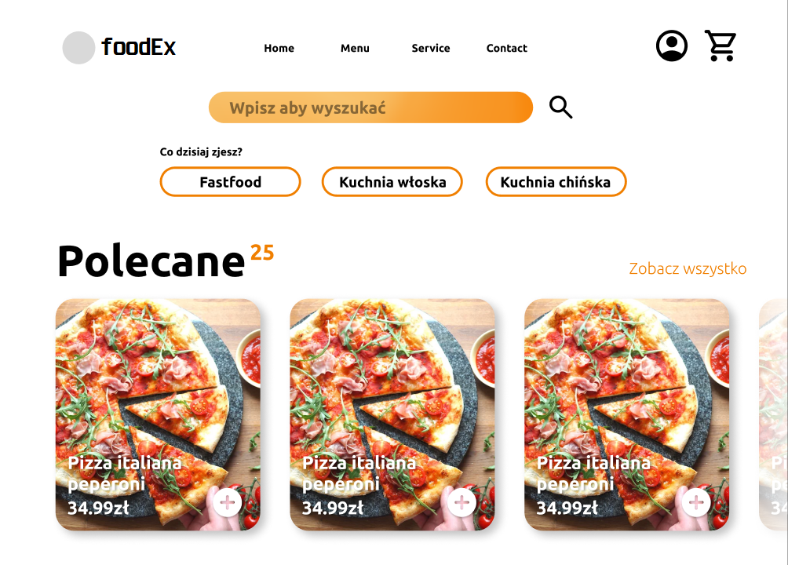

# FoodEx - Aplikacja do zamawiania jedzenia

FoodEx to aplikacja, która umożliwia łatwe i wygodne zamawianie jedzenia online. Zainspirowana popularną platformą "Pyszne.pl", FoodEx oferuje szeroki wybór restauracji i dań, dostępnych do dostawy lub odbioru osobistego. Ta aplikacja ułatwi Ci zamówienie ulubionego jedzenia z wygodą i szybkością.

## Funkcje

- **Wszechstronny wybór restauracji**: FoodEx gromadzi różnorodne restauracje, aby zapewnić Ci duży wybór i możliwość eksploracji różnych kuchni.
- **Zamówienie online**: Możesz przeglądać menu restauracji, wybierać dania i dodatki oraz składać zamówienia online.
- **Dostawa lub odbiór osobisty**: Możesz wybrać preferowany sposób otrzymania zamówienia - dostawę pod wskazany adres lub odbiór osobisty w wybranej restauracji.
- **Łatwe płatności**: Aplikacja FoodEx obsługuje różne metody płatności, w tym płatności online lub gotówką przy odbiorze zamówienia.
- **Monitorowanie zamówienia**: Po złożeniu zamówienia możesz śledzić jego status w czasie rzeczywistym, aby być na bieżąco z przygotowaniem i dostawą.
- **Ulubione restauracje i zamówienia**: Możesz zapisywać ulubione restauracje i powtarzać wcześniejsze zamówienia w prosty sposób.

## Wymagania systemowe

Aby móc korzystać z aplikacji FoodEx, Twój urządzenie musi spełniać następujące wymagania:

- System operacyjny: Windows 10, macOS 10.12 Sierra lub nowszy, Android 7.0 Nougat lub nowszy, iOS 11 lub nowszy.
- Połączenie internetowe.

## Licencja

Ten projekt jest licencjonowany na podstawie [Licencji MIT](LICENSE).
